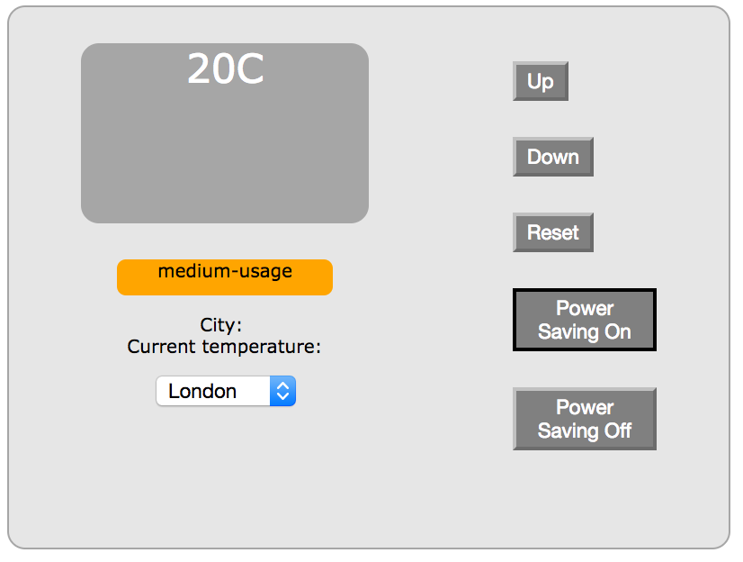
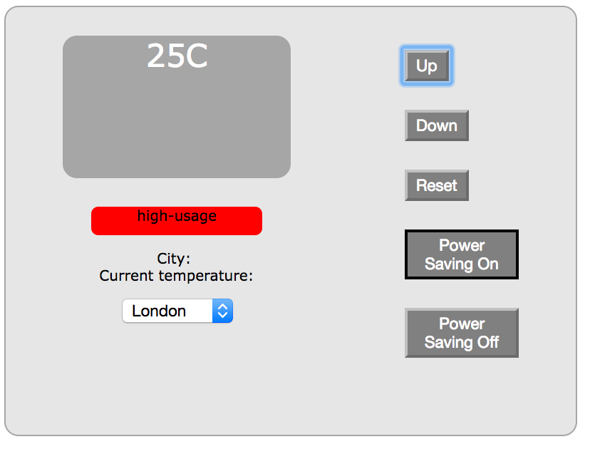
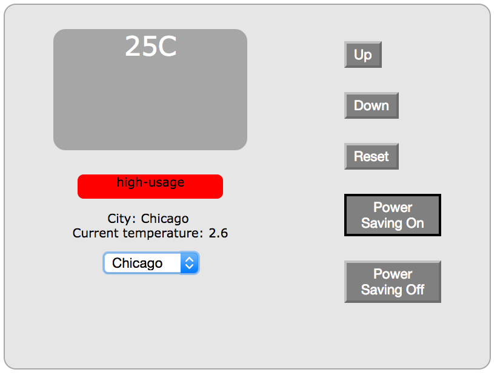
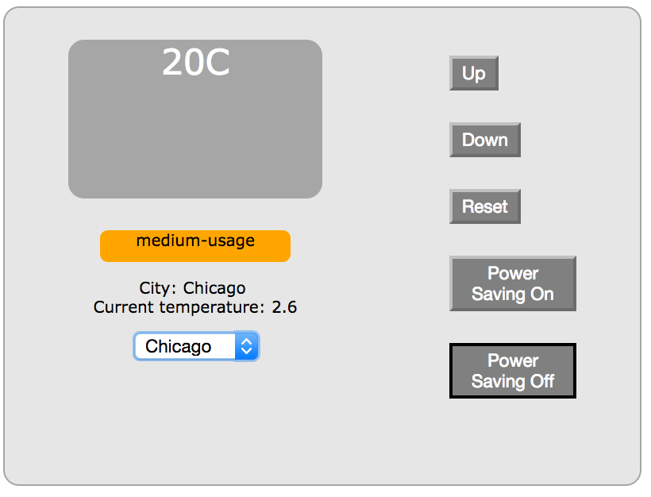

# Thermostat

### Purpose
This project recreates a thermometer capable of storing user settings

### User Stories
```
As a user,
So that I can start with a default temperature
I would like to start the thermostat at 20 degrees

As a user,
So that I can make the room warmer,
I would like to increase the temperature

As a user,
So that I can make the room colder,
I would like to decrease the temperature

As a user,
So that I can ensure the room does not get too cold,
I would like to set a minimum temperature of 10 degrees

As a user,
So that I can control my power savings,
I would like to enable power saving mode

As a user,
So that I can ensure the room does not get too hot in power saving mode,
I would like to set a maximum temperature of 25 degress if power saving mode is on

As a user,
So that I can modify my power savings,
I would like to disable power saving mode

As a user,
So that I can ensure the room does not get too hot while not in power saving mode,
I would like to set a maximum temperature of 32 degrees if power saving mode is off

As a user,
So that I can ensure power saving,
I would like to enable power saving mode by default

As a user,
So that I can quickly reset the temperature,
I would like to reset the temperature to 20 degrees with one action

As a user,
So that I can understand my thermostat's current energy usage,
I would like to view an energy usage of 'low-usage' if the temperature is below 18 degrees

As a user,
So that I can understand my thermostat's current energy usage,
I would like to view an energy usage of 'medium-usage' if the temperature is between 18 and 25 degrees

As a user,
So that I can understand my thermostat's current energy usage,
I would like to view an energy usage of 'high-usage' if the temperature is above 25 degrees

As a user,
So that I can understand the temperature in my location,
I would like to select a location at which tos view the temperature

As a user,
So that I do not have to configure settings to match my previous room environment,
I would like my settings to be remembered the next time I turn on my thermostat
```

### Set Up
1. Fork this repository
2. Clone on to local machine
3. Run `bundle` to ensure required gems
4. Create two new local PostgreSQL databases, `thermostat_development` and `thermostat_test`

### How to Use
1. Load program by running `index.html` in your browser of choice



2. Use up and down buttons to increase and decrease the temperature (interface responds by amending temperature shown, energy usage)



3. Change city using drop down menu



4. Enable/disable power saving mode



5. Reload page to ensure settings are maintained

### Technology Used
* JavaScript / jQuery (for business logic and event handling)
* Jasmine, for JavaScript testing
* Sinatra (as web server, controller)
* RSpec, for Ruby testing
* PostgreSQL (as database)
* DataMapper (as ORM)
* HTML / CSS (for user interface)
